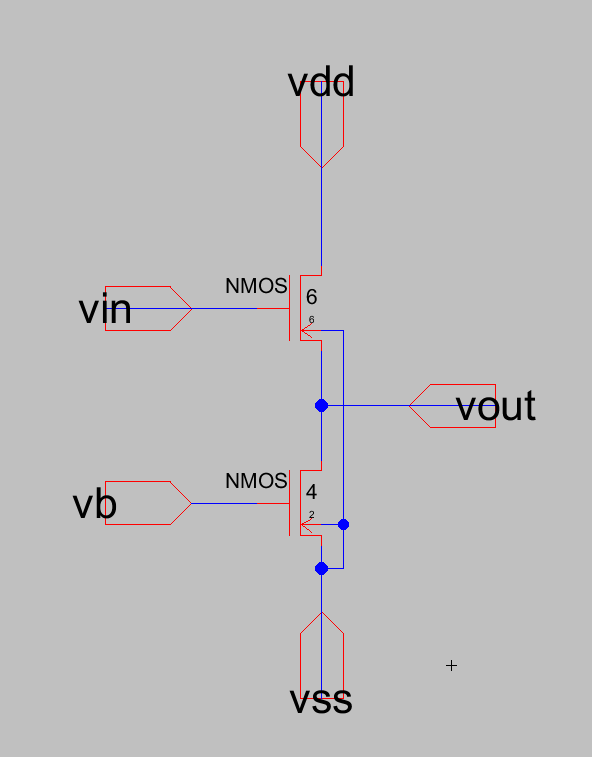
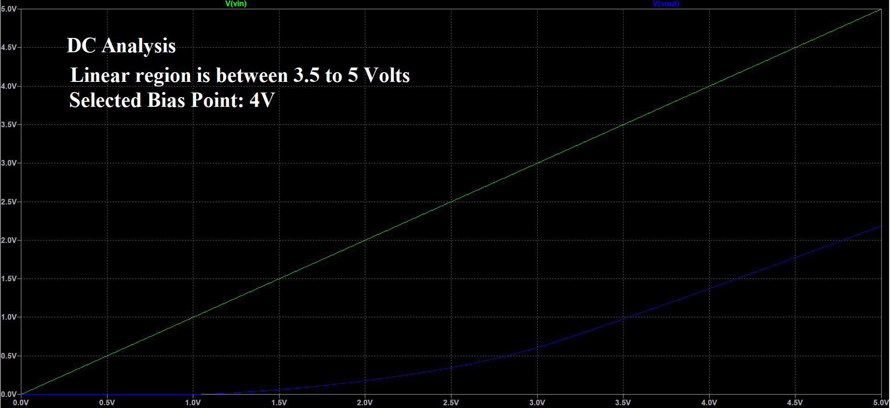
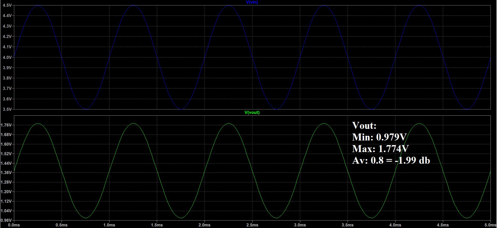
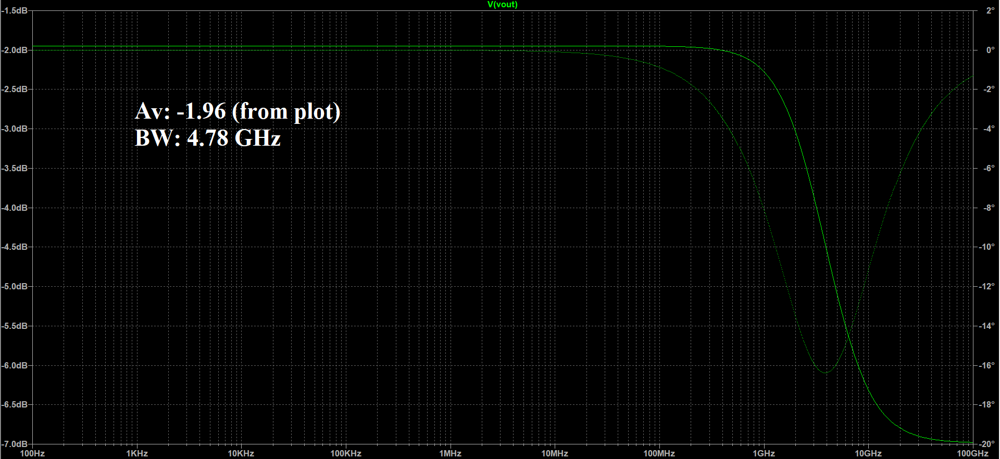
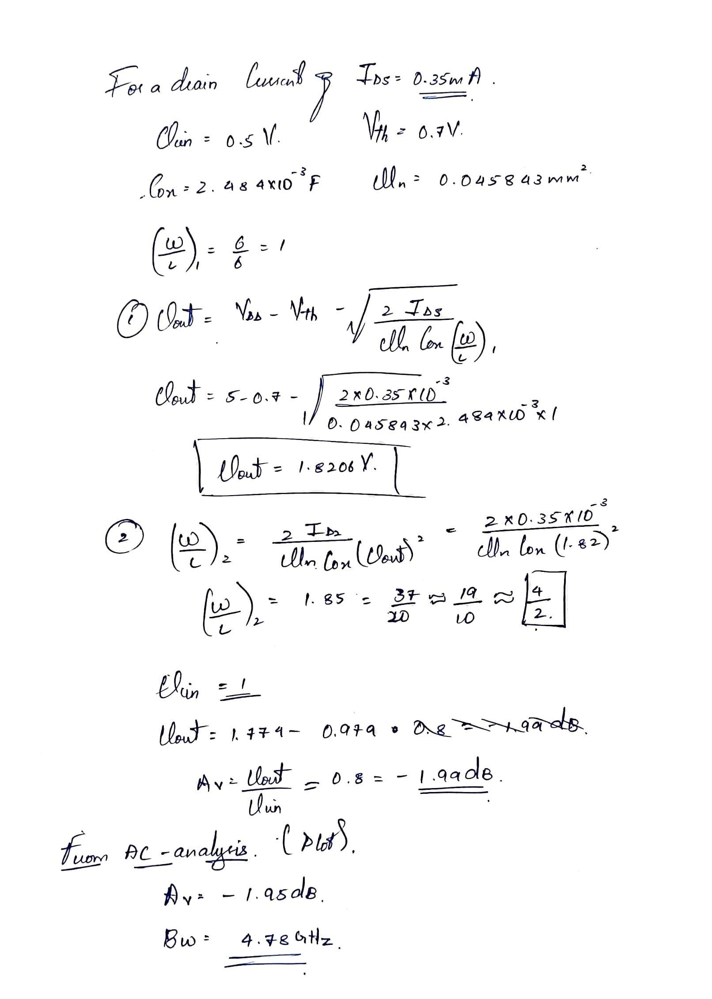

# Common Drain Amplifier - Source Follower
### Given
- `Id` = 0.35 mA
- at `Vb` = 1.5V
- `Vout` = 1.82V
- `(W/L)1` = 6/6 = 1
- `(W/L)2` = 1.85 ~= 2
- `W2` = 4
- `l2` = 2

### Observations
- Gain: -1.99 db
- Bandwidth = 4.78GHz

## Schematic
<!--  -->


# Spice Code
```SPICE
.include D:\Electric\C5_models.txt 
vdd vdd 0 DC 5
vss vss 0 DC 0
vb vb 0 DC 1.5


#DC
vin vin 0 DC 2
.dc vin 0 5 1m


#TRANS
vin vin 0 sin(4 0.5 1k 0 0 0 0)
.trans 0 5m


#AC
vin vin 0 ac sin(4 0.5 1k 0 0 0 0)
.ac dec 100 100 100G
```


## DC Analysis


## Transient Analysis


## AC Analysis



<!-- ### Hand Written -->
