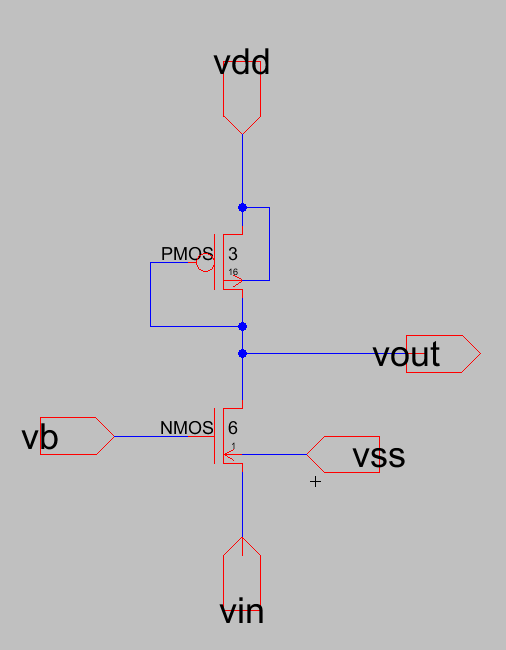
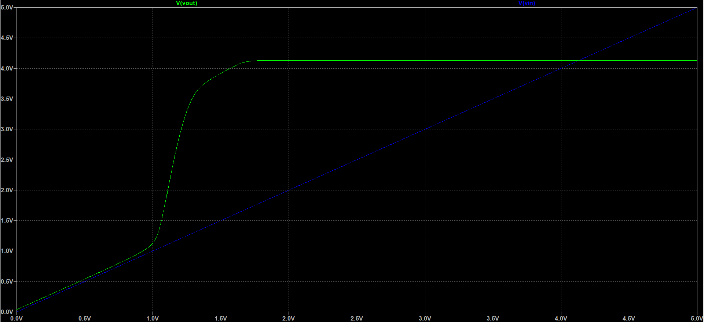
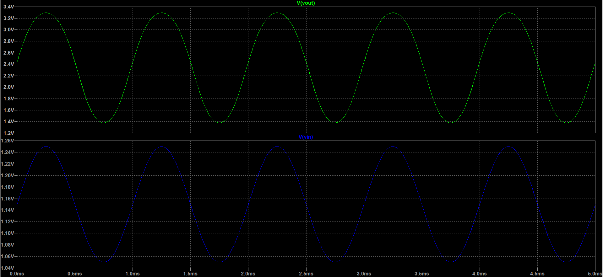
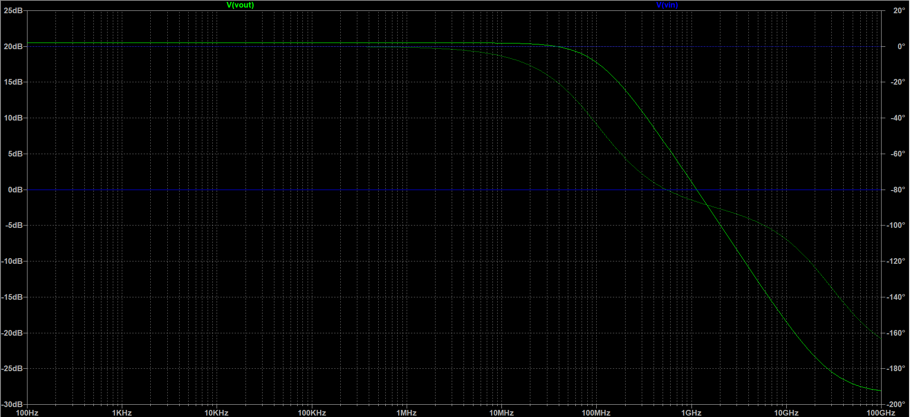

# Common Gate Amplifier
### Given
- Designed Gain `Av` = 10
    - `Av = gm1 * Rd`
    - `Rd = 1/gm2`
    - `Av = gm1/gm2`
    - `Av^2 = 2*(W/L)1 / (W/L)2`
    - Assuming `(W/L) = 6/1`
    - `(W/L)2 = 3/16`

### Observations
- Transient Analysis
    - Gain: 9.5
- AC Analysis
    - Gain = `10.59` = `20.5 db`
    - Bandwidth = `106.6 MHz`

## Schematic
<!--  -->


# Spice Code
## Common Code
```SPICE
.include D:\Electric\C5_models.txt 
vdd vdd 0 DC 5
vss vss 0 DC 0
vb vb 0 DC 2
```
## DC Analysis
```SPICE
vin vin 0 DC 2
.dc vin 0 5 1m
```
## Transient Analysis
```SPICE
vin vin 0 sin(1.15 0.1 1k 0 0 0 0)
.trans 0 5m
```
## AC Analysis
```SPICE
vin vin 0 ac sin(1.15 0.1 1k 0 0 0 0)
.ac dec 100 100 100G
```

# Plots
## DC Analysis


## Transient Analysis


## AC Analysis



<!-- ### Hand Written -->
